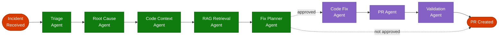

# RemediAI — Agent Design

## Overview

RemediAI uses a LangGraph-based multi-agent pipeline to process application exceptions from ingestion through to remediation. Each agent has a single responsibility, a defined input/output contract, and writes an audit record for every execution.

---

## Agent Pipeline



> **Color key:** Green = MVP agents &nbsp;·&nbsp; Purple = Phase 2 agents (dashed) &nbsp;·&nbsp; Red = Start / End nodes

Agents run sequentially within the LangGraph state machine. Each agent receives the shared `IncidentState` object and returns an updated version of it.

---

## Shared State — `IncidentState`

```python
class IncidentState(TypedDict):
    incident_id: str
    correlation_id: str
    exception_type: str
    exception_message: str
    stack_trace: str
    raw_payload: dict

    # Triage outputs
    priority: str | None
    triage_labels: list[str]
    group_id: str | None

    # Root cause outputs
    root_cause_summary: str | None
    root_cause_json: dict | None

    # Code context outputs
    code_snippets: list[CodeSnippet]

    # RAG outputs
    rag_results: list[RAGResult]

    # Fix planner outputs
    recommendations: list[Recommendation]

    # Approval gate + PR outputs
    approval_status: str | None
    approved_recommendation_rank: int | None

    # Phase 2
    pr_branch: str | None
    pr_url: str | None
    validation_report: dict | None

    # Audit
    agent_trace: list[AgentTraceEntry]
    errors: list[str]
```

---

## Agent Specifications

### 1. Triage Agent

**Purpose:** Assign priority and labels to the incident. Group related incidents.

**Input fields used:**
- `exception_type`, `exception_message`, `stack_trace`, `raw_payload`

**Output fields set:**
- `priority` — `critical | high | medium | low`
- `triage_labels` — e.g., `["null-reference", "authentication", "timeout"]` plus an optional language tag such as `"dotnet"`, `"python"`, `"nodejs"`
- `group_id` — UUID of an existing open incident group, if applicable

**Logic:**
1. Apply language-aware rule-based pattern matching for known exception types:
   - .NET: `NullReferenceException` → `null-reference`; `TimeoutException` → `timeout`; etc.
   - Python: `AttributeError`, `TypeError` → `null-reference`; `TimeoutError` → `timeout`; etc.
   - Node.js: `TypeError: Cannot read properties of undefined` → `null-reference`; etc.
   - Java: `NullPointerException` → `null-reference`; `java.sql.SQLException` → `database`; etc.
2. Call LLM with triage prompt to assign priority and additional labels if no rule matched.
3. Query open incidents for similar fingerprints to determine grouping.

**Prompt:** `docs/prompts/triage_v1.md`

---

### 2. Root Cause Agent

**Purpose:** Identify the most likely root cause of the exception.

**Input fields used:**
- `exception_type`, `exception_message`, `stack_trace`, `triage_labels`

**Output fields set:**
- `root_cause_summary` — 2–4 sentence human-readable explanation
- `root_cause_json` — structured breakdown:
  ```json
  {
    "component": "UserService.GetById",
    "likely_cause": "Unhandled null return from database query",
    "contributing_factors": ["Missing null check", "Repository pattern not validated"],
    "confidence": 0.87
  }
  ```

**Logic:**
1. Parse stack trace using the language-appropriate parser (.NET, Python, Node.js, Java) to identify the top 5 significant user-code frames (skip framework/library internals).
2. Call LLM with root cause prompt, including stack frames, exception message, and detected language.
3. Extract structured JSON from response.
4. Append to `agent_trace`.

**Prompt:** `docs/prompts/root_cause_v1.md`

---

### 3. Code Context Agent

**Purpose:** Retrieve source code relevant to the exception stack frames.

**Input fields used:**
- `stack_trace`, `root_cause_json`

**Output fields set:**
- `code_snippets` — list of `CodeSnippet`:
  ```python
  class CodeSnippet(BaseModel):
      file_path: str
      start_line: int
      end_line: int
      content: str
      repo: str
      commit_sha: str
  ```

**Logic:**
1. Parse stack trace to extract file paths and line numbers (using language-appropriate parser from Root Cause Agent).
2. Use the configured source control client (Azure DevOps Repos for MVP; GitHub Phase 38+) to fetch file content at the identified lines ± 20 lines of context.
3. Limit to 5 most relevant snippets.
4. Skip snippets from framework/library internals using language-aware prefix filtering:
   - .NET: `System.*`, `Microsoft.*`, `Azure.*`
   - Python: `site-packages/`, standard library paths
   - Node.js: `node_modules/`
   - Java: `java.*`, `javax.*`, `org.springframework.*`

**No LLM call required for this agent.**

---

### 4. RAG Retrieval Agent

**Purpose:** Retrieve relevant documentation, runbooks, and prior remediation records.

**Input fields used:**
- `root_cause_summary`, `root_cause_json`, `triage_labels`

**Output fields set:**
- `rag_results` — list of `RAGResult`:
  ```python
  class RAGResult(BaseModel):
      source: str
      title: str
      excerpt: str
      relevance_score: float
      url: str | None
  ```

**Logic:**
1. Build search query from root cause summary and exception type.
2. Query Azure AI Search index (hybrid: keyword + vector).
3. Return top 5 results with score > 0.6.
4. Filter results by source type priority: `runbook > prior_fix > documentation > source_code`.

---

### 5. Fix Planner Agent

**Purpose:** Generate ranked remediation recommendations.

**Input fields used:**
- `root_cause_summary`, `root_cause_json`, `code_snippets`, `rag_results`

**Output fields set:**
- `recommendations` — list of `Recommendation`:
  ```python
  class Recommendation(BaseModel):
      rank: int
      title: str
      description: str
      affected_files: list[str]
      suggested_change: str
      confidence: float
      source_refs: list[str]
  ```

**Logic:**
1. Call LLM with fix planner prompt, passing root cause, code snippets, and RAG excerpts.
2. Parse structured recommendations list from response.
3. Sort by confidence score descending.
4. Limit to top 3 recommendations.

**Prompt:** `docs/prompts/fix_planner_v1.md`

---

### 6. Human Approval Gate (Phase 2)

**Purpose:** Record an explicit human approval decision for a recommendation before PR creation can run.

**Input fields used:**
- `recommendations`
- `approval_status`
- `approved_recommendation_rank`

**Output fields set:**
- `approval_status`
- `approved_recommendation_rank`

**Logic:**
1. Persist the selected approval decision on the incident row.
2. Require `approval_status == "approved"` and a selected recommendation rank before PR creation can proceed.
3. Do not call an LLM for approval capture.

---

### 7. PR Agent (Phase 2)

**Purpose:** Create a branch and draft PR applying an approved fix recommendation.

**Trigger:** Requires explicit human approval of a recommendation in the dashboard. Never runs automatically.

**Input fields used:**
- Approved `Recommendation` from `recommendations`

**Output fields set:**
- `pr_branch`
- `pr_url`

**Logic:**
1. Create a new branch from the default branch: `remedia/{incident_id}/{recommendation_rank}`.
2. Apply the suggested change as a patch to the target file(s).
3. Commit with message: `[RemediAI] Fix for incident {incident_id}: {recommendation.title}`.
4. Create a draft PR in Azure DevOps Repos, tagged for human review.
5. Never set auto-complete on the PR.

---

### 8. Validation Agent (Phase 2)

**Purpose:** Inspect the draft PR diff for obvious issues before human review.

**Input fields used:**
- `pr_url`, `pr_branch`

**Output fields set:**
- `validation_report`

**Logic:**
1. Fetch PR diff from Azure DevOps.
2. Run static checks: syntax validation, no secrets introduced, diff size within limits.
3. Call LLM with validation prompt to review the diff for correctness and risks.
4. Produce a validation report attached to the PR description.

---

## Prompt Versioning

All LLM prompts are stored as versioned Markdown files under `docs/prompts/`.

```text
docs/prompts/
  triage_v1.md
  root_cause_v1.md
  fix_planner_v1.md
  validation_v1.md
```

Prompts are loaded by name and version at agent startup. Version is recorded in the `agent_trace` for each run.

---

## Error Handling

- Each agent wraps its logic in a try/except block.
- On error, the exception is appended to `state.errors` and the agent returns the state unchanged.
- The pipeline continues to the next agent unless the error is in a blocking agent (Root Cause, Bug Creation).
- Failed incidents are marked `status = 'analysis_failed'` and logged for manual review.
- Retry logic with exponential backoff applies to Azure API calls (Service Bus, ADO, AI Search).

---

## Audit Trail

Every agent appends an `AgentTraceEntry` to `state.agent_trace`:

```python
class AgentTraceEntry(BaseModel):
    agent_name: str
    prompt_version: str | None
    input_summary: str
    output_summary: str
    llm_model: str | None
    tokens_used: int | None
    latency_ms: int
    timestamp: datetime
    error: str | None
```

The full trace is persisted to the `incident_analyses.agent_trace` column and mirrored to the `audit_log` table.
