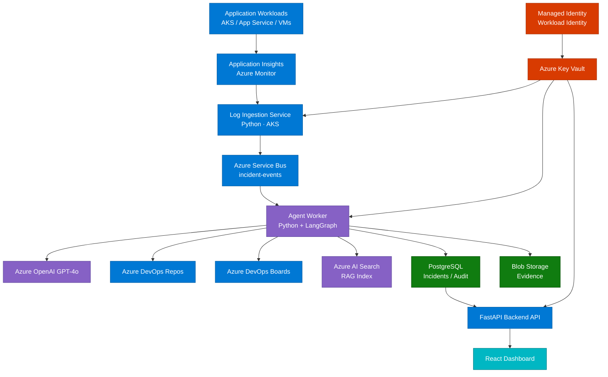

# RemediAI — Architecture

## Overview

RemediAI is a cloud-native agentic platform running on Azure. It is composed of independently deployable services that communicate via Azure Service Bus and share state through PostgreSQL.

---

## Component Diagram



> **Color key:** Blue = Azure services &nbsp;·&nbsp; Purple = AI / Agent layer &nbsp;·&nbsp; Green = Data stores &nbsp;·&nbsp; Teal = UI &nbsp;·&nbsp; Red = Security

---

## Services

### Log Ingestion Service (`apps/worker/ingestion/`)

Polls Azure Monitor / Application Insights using KQL on a configurable schedule. Deduplicates exceptions by fingerprint hash. Publishes new `IncidentEvent` messages to the `incident-events` Service Bus topic.

- Runtime: Python
- Trigger: Azure Monitor KQL schedule
- Output: Service Bus message → `incident-events`
- Auth: Managed Identity → Key Vault

### Agent Worker (`apps/worker/agents/`)

Subscribes to the `incident-events` Service Bus topic. Runs the LangGraph pipeline for each incident. Writes analysis results, work item records, and audit entries to PostgreSQL.

- Runtime: Python + LangGraph
- Trigger: Service Bus subscription
- Dependencies: Azure OpenAI, Azure DevOps REST, Azure AI Search, PostgreSQL
- Auth: Managed Identity

### Backend API (`apps/api/`)

FastAPI application exposing REST endpoints for the dashboard and external consumers. Reads from PostgreSQL. Does not write directly to Azure services.

- Runtime: Python + FastAPI
- Trigger: HTTP
- Dependencies: PostgreSQL, Redis (cache)
- Auth: Azure AD / API key (configurable)

### Dashboard (`apps/dashboard/`)

React + TypeScript SPA. Communicates only with the Backend API. Displays incidents, analyses, work item links, and metrics.

- Runtime: Node.js (build) / static hosting on AKS
- Dependencies: Backend API

---

## LangGraph Agent Pipeline

```mermaid
flowchart LR
    classDef mvp fill:#107C10,stroke:#054B05,color:#fff
    classDef phase2 fill:#8661C5,stroke:#5C4799,color:#fff
    classDef terminal fill:#D83B01,stroke:#A52D01,color:#fff

    S(["Start"]):::terminal
    T["Triage"]:::mvp
    RC["Root Cause"]:::mvp
    CC["Code Context"]:::mvp
    RAG["RAG Retrieval"]:::mvp
    FP["Fix Planner"]:::mvp
    BC["Bug Creation"]:::mvp
    E(["End"]):::terminal
    PR["PR Agent"]:::phase2
    VA["Validation Agent"]:::phase2

    S --> T --> RC --> CC --> RAG --> FP --> BC --> E
    BC -.->|"Phase 2"| PR
    PR -.->|"Phase 2"| VA
    VA -.-> E
```



> **Color key:** Green = MVP agents &nbsp;·&nbsp; Purple = Phase 2 agents (dashed) &nbsp;·&nbsp; Red = Start / End

### Agent Responsibilities

| Agent            | Input                              | Output                                 |
| ---------------- | ---------------------------------- | -------------------------------------- |
| Triage           | Raw exception + metadata           | Priority, grouping, triage labels      |
| Root Cause       | Exception + stack trace + logs     | Structured root cause summary          |
| Code Context     | Stack frames + repo config         | Relevant source snippets               |
| RAG Retrieval    | Root cause summary                 | Related docs, runbooks, past fixes     |
| Fix Planner      | Root cause + code + RAG results    | Ranked remediation recommendations     |
| Bug Creation     | Incident analysis                  | Azure DevOps Bug ID + URL              |
| PR Agent         | Approved recommendation            | Branch + draft PR URL (Phase 2)        |
| Validation Agent | PR diff + test results             | Validation report (Phase 2)            |

---

## Data Flow

```text
1. App Insights → KQL query → Log Ingestion Service
2. Log Ingestion Service → fingerprint check → PostgreSQL (upsert)
3. Log Ingestion Service → Service Bus → incident-events topic
4. Agent Worker → Service Bus subscription → incident dequeued
5. Agent Worker → LangGraph pipeline begins (Triage → ... → Bug Creation)
6. Each agent step → writes to PostgreSQL (incident_analyses, audit_log)
7. Bug Creation agent → Azure DevOps Boards REST API → work_items table
8. Backend API → reads PostgreSQL → serves dashboard and consumers
9. React Dashboard → polls Backend API → renders incident list + detail
```

---

## Database Schema (Key Tables)

```sql
-- Incidents
CREATE TABLE incidents (
    id              UUID PRIMARY KEY DEFAULT gen_random_uuid(),
    correlation_id  UUID NOT NULL,
    source          TEXT NOT NULL,
    exception_type  TEXT NOT NULL,
    exception_message TEXT NOT NULL,
    stack_trace     TEXT,
    fingerprint     TEXT NOT NULL UNIQUE,
    priority        TEXT NOT NULL DEFAULT 'medium',
    status          TEXT NOT NULL DEFAULT 'new',
    raw_payload     JSONB,
    created_at      TIMESTAMPTZ NOT NULL DEFAULT now(),
    updated_at      TIMESTAMPTZ NOT NULL DEFAULT now()
);

-- Analyses
CREATE TABLE incident_analyses (
    id              UUID PRIMARY KEY DEFAULT gen_random_uuid(),
    incident_id     UUID NOT NULL REFERENCES incidents(id),
    root_cause      TEXT,
    root_cause_json JSONB,
    recommendations JSONB,
    code_snippets   JSONB,
    rag_results     JSONB,
    agent_trace     JSONB,
    created_at      TIMESTAMPTZ NOT NULL DEFAULT now()
);

-- Work Items
CREATE TABLE work_items (
    id              UUID PRIMARY KEY DEFAULT gen_random_uuid(),
    incident_id     UUID NOT NULL REFERENCES incidents(id),
    ado_item_id     INTEGER NOT NULL,
    ado_item_url    TEXT NOT NULL,
    item_type       TEXT NOT NULL DEFAULT 'bug',
    created_at      TIMESTAMPTZ NOT NULL DEFAULT now()
);

-- Audit Log
CREATE TABLE audit_log (
    id              UUID PRIMARY KEY DEFAULT gen_random_uuid(),
    incident_id     UUID REFERENCES incidents(id),
    agent_name      TEXT NOT NULL,
    action          TEXT NOT NULL,
    input_summary   TEXT,
    output_summary  TEXT,
    metadata        JSONB,
    created_at      TIMESTAMPTZ NOT NULL DEFAULT now()
);
```

---

## Infrastructure

All components run on AKS with Workload Identity for Managed Identity binding.

```text
infrastructure/
  terraform/
    modules/
      aks/
      servicebus/
      keyvault/
      postgresql/
      aisearch/
      storage/
  helm/
    remedia-api/
    remedia-worker/
    remedia-dashboard/
  k8s/
    namespaces/
    serviceaccounts/
    network-policies/
```

---

## Deployment Model

- Each service has its own Helm chart and AKS Deployment.
- Secrets are mounted from Key Vault via the Azure Key Vault provider for Secrets Store CSI Driver.
- Log Ingestion and Agent Worker scale via KEDA using Service Bus queue depth.
- Backend API scales via HPA on CPU/memory.
- PostgreSQL is hosted on Azure Database for PostgreSQL — Flexible Server.

---

## Observability

| Signal  | Tool                           |
| ------- | ------------------------------ |
| Logs    | Structured JSON → Azure Monitor Workspace |
| Traces  | OpenTelemetry → Azure Monitor  |
| Metrics | Prometheus → Azure Managed Grafana |
| Alerts  | Azure Monitor Alerts           |

All log lines include `correlation_id`, `incident_id`, `agent_name`, and `service` fields.
