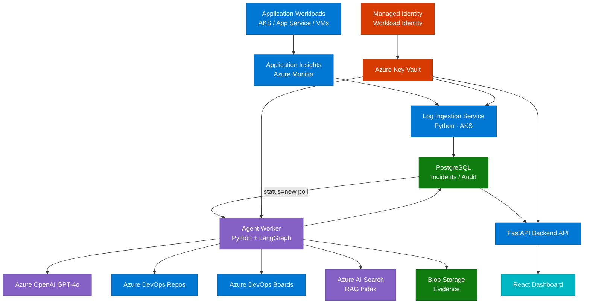

# RemediAI

[](LICENSE)
[]()
[](CONTRIBUTING.md)

RemediAI is an AI-powered exception analysis and remediation platform for enterprise .NET applications on Azure that detects exceptions from Azure Monitor / Application Insights, analyzes root causes with AI agents, recommends fixes, and generates Azure DevOps work items and pull requests for human review.

---

## Start Here

This README is the first file every new contributor should read. It provides project overview, setup instructions, architecture summary, and development guidelines in one place.

### Setup Instructions (Local)

1. Install prerequisites described in [CONTRIBUTING.md](CONTRIBUTING.md).
2. Create local environment variables:
  ```bash
  cp .env.example .env
  ```
3. Start local services and applications:
  ```bash
  make local-up
  ```
4. Run database migrations:
  ```bash
  make local-migrate
  ```
5. Validate local health checks:
  ```bash
  make local-smoke
  ```

### Architecture Summary

- High-level platform architecture is shown below in this README.
- Detailed system design and data flow: [ARCHITECTURE.md](ARCHITECTURE.md)
- Agent pipeline and contracts: [AGENT_DESIGN.md](AGENT_DESIGN.md)

### Development Guidelines

- Follow the contributor workflow and standards in [CONTRIBUTING.md](CONTRIBUTING.md).
- Keep implementation aligned with [SPEC.md](SPEC.md) and [ROADMAP.md](ROADMAP.md).
- Follow security requirements in [SECURITY_GUARDRAILS.md](SECURITY_GUARDRAILS.md).

---

## Why RemediAI?

Modern applications running on AKS, App Service, or Azure VMs generate exceptions across multiple observability platforms. Engineers spend hours triaging the same recurring patterns. RemediAI provides a scalable agentic framework to automate that investigation — so teams focus on fixing, not finding.

- Reads exception logs from Application Insights / Azure Monitor
- Groups and triages incidents automatically
- Analyzes root cause using LangGraph-based AI agents
- Finds related source code in Azure DevOps Repos
- Recommends fixes with supporting evidence
- Creates Azure DevOps Bugs with full context
- Generates draft Pull Requests after human approval
- Tracks remediation progress in a React dashboard
- Exposes integration health warnings and provider status in the dashboard
- Supports explicit monitoring target selection for local and Kubernetes modes

---

## High-Level Architecture



> **Color key:** Blue = Azure services &nbsp;·&nbsp; Purple = AI / Agent layer &nbsp;·&nbsp; Green = Data stores &nbsp;·&nbsp; Teal = UI &nbsp;·&nbsp; Red = Security

---

## Core Workflow

```
1. Exception appears in Application Insights.
2. Log ingestion service queries Azure Monitor using KQL.
3. Incident is written to PostgreSQL with `status='new'`.
4. LangGraph worker polls PostgreSQL and picks up the incident.
5. Triage Agent assigns priority and groups related incidents.
6. Root Cause Agent analyzes the exception and stack trace.
7. Code Context Agent retrieves relevant source files.
8. RAG Agent fetches docs, runbooks, and prior fixes.
9. Fix Planner Agent produces ranked remediation recommendations.
10. Azure DevOps Bug is created with full analysis attached.
11. (Phase 2) PR Agent creates a draft pull request after human approval.
12. Dashboard shows status, metrics, integration warnings, and target policy.
```

---

## MVP Scope

| In Scope                              | Out of Scope                        |
| ------------------------------------- | ----------------------------------- |
| .NET application exceptions           | Auto-merge pull requests            |
| Azure Monitor / Application Insights  | Direct production changes           |
| Azure DevOps Repos + Boards           | Jira integration                    |
| Python backend + LangGraph agents     | Node.js / Java / Python app support |
| Azure AI Foundry / Azure OpenAI       | Grafana / Loki / Datadog ingestion  |
| PostgreSQL + Redis                    | Full self-healing automation        |
| React dashboard                       |                                     |

---

## Technology Stack

| Layer               | Technology                              |
| ------------------- | --------------------------------------- |
| Backend API         | Python 3.12 + FastAPI                   |
| Agent Orchestration | LangGraph                               |
| AI Platform         | Azure AI Foundry / Azure OpenAI GPT-4o (default) + portable adapters |
| RAG                 | Azure AI Search (hybrid)                |
| Log Source          | Application Insights / Azure Monitor    |
| Work Queue          | PostgreSQL `incidents.status` polling   |
| Database            | PostgreSQL 16 on AKS                    |
| Cache               | Redis 7 on AKS                          |
| UI                  | React 18 + TypeScript                   |
| Hosting             | AKS (Azure Kubernetes Service)          |
| Secrets             | Azure Key Vault + Managed Identity      |
| Infrastructure      | Terraform + Helm                        |

See [TECH_STACK.md](TECH_STACK.md) for the full stack with rationale and dependency lists.

---

## Repository Structure

```
remediai/
  .github/
    copilot-instructions.md  # Repository-wide Copilot rules
    instructions/            # Scoped instruction layers by concern

  docs/
    product/          # Product briefs and discovery notes
    architecture/     # Architecture decision records (ADRs)
    specs/            # Detailed specifications
    prompts/          # Versioned LLM prompt contracts
    runbooks/         # Operational runbooks

  apps/
    api/              # FastAPI backend
    worker/           # Log ingestion + agent worker
    dashboard/        # React TypeScript frontend

  packages/
    domain/           # Shared domain models (Pydantic)
    integrations/     # Azure service clients
    agent_runtime/    # LangGraph pipeline and agent base classes
    data_access/      # SQLAlchemy models and repositories

  infrastructure/
    terraform/        # Azure resource provisioning
    helm/             # Kubernetes deployment charts
    k8s/              # Namespace, RBAC, network policy manifests

  pipelines/
    azure-devops/     # CI/CD pipeline YAML

  scripts/
    validate_prompt_contracts.py  # Prompt contract validator

  tests/
    integration/      # Integration tests (Azure mock clients)
    e2e/              # End-to-end tests
    agent-evals/      # Agent quality evaluation fixtures

  README.md
  CONTRIBUTING.md
  SECURITY.md
  SPEC.md
  ROADMAP.md
  ARCHITECTURE.md
  AGENT_DESIGN.md
  TECH_STACK.md
  SECURITY_GUARDRAILS.md
```

---

## Implementation Phases

Phases 1–21 are complete. Remaining work runs across parallel tracks.

| Track | Phases | Focus |
| ----- | ------ | ----- |
| A — Quality & Security | 15, 17, 18 | PII scrubbing, AI Search index, RAG quality |
| B — PR Workflow | 19, 20, 21 | PR agent, human approval gate, validation |
| C — DevOps & Infrastructure | 22, 23, 24, 25, 26, 27 | CI/CD, Terraform, AKS, Key Vault, scaling |
| D — Testing & Observability | 16, 23, 28 | E2E tests, OpenTelemetry, load + security testing |

Tracks A, B, C, and D can be staffed in parallel. Phase 28 (load + security
testing) is the final gate that requires all tracks to be complete.

See [ROADMAP.md](ROADMAP.md) for the full dependency graph, milestone detail, and release versioning.

---

## Security Principles

- Human approval required before any code change is merged
- No direct production access for any agent
- Read-only access to logs and source code
- Managed Identity / Workload Identity — no stored credentials
- Azure Key Vault for all secrets
- PII scrubbed from exception payloads before LLM transmission
- Full audit trail for every agent decision
- All PRs validated before human review

See [SECURITY_GUARDRAILS.md](SECURITY_GUARDRAILS.md) for the full security design. To report a vulnerability, see [SECURITY.md](SECURITY.md).

---

## Documentation

| Document                                        | Purpose                                       |
| ----------------------------------------------- | --------------------------------------------- |
| [SPEC.md](SPEC.md)                              | Product specification and functional requirements |
| [ARCHITECTURE.md](ARCHITECTURE.md)              | System design, services, data flow, schema    |
| [AGENT_DESIGN.md](AGENT_DESIGN.md)              | Agent pipeline, contracts, prompts, audit     |
| [TECH_STACK.md](TECH_STACK.md)                  | Full stack with rationale and dependencies    |
| [SECURITY_GUARDRAILS.md](SECURITY_GUARDRAILS.md)| Security design, identity, PII, compliance    |
| [ROADMAP.md](ROADMAP.md)                        | Milestones and release versioning             |

The top-level Markdown files remain the internal source-of-truth for architecture, security, and planning. The Docusaurus site in `apps/docs/` publishes a curated version of that material rather than replacing it.

---

## Contributing

See [CONTRIBUTING.md](CONTRIBUTING.md) for how to set up the dev environment, branch conventions, and the PR process.

---

## License

Apache License 2.0 — see [LICENSE](LICENSE).
