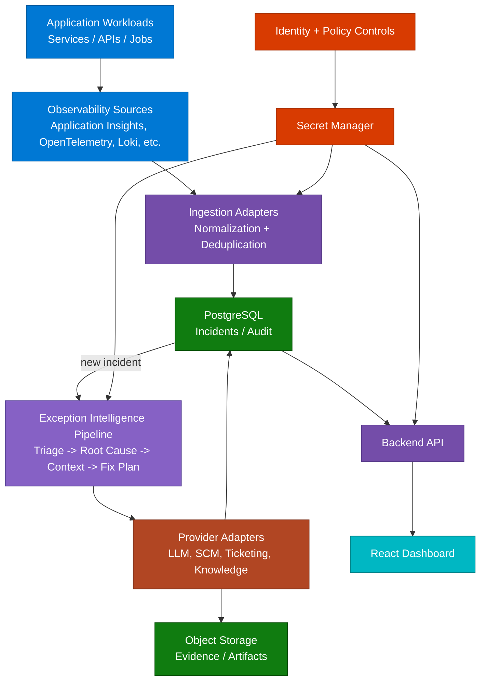

# RemediAI

[](LICENSE)
[]()
[](CONTRIBUTING.md)

RemediAI is an AI-powered exception analysis and remediation platform for modern applications that ingests exceptions from observability sources (for example, Azure Monitor / Application Insights), analyzes root causes with AI agents, recommends fixes, and generates work items and pull requests for human review.

---

## Start Here

This README is the first file every new contributor should read. It provides project overview, setup instructions, architecture summary, and development guidelines in one place.

### Setup Instructions (Local)

1. Install prerequisites described in [CONTRIBUTING.md](CONTRIBUTING.md).
2. Create local environment variables:
  ```bash
  cp .env.example .env
  ```
3. Start local services and applications:
  ```bash
  make local-up
  ```
4. Run database migrations:
  ```bash
  make local-migrate
  ```
5. Validate local health checks:
  ```bash
  make local-smoke
  ```

### Architecture Summary

- High-level platform architecture is shown below in this README.
- Detailed system design and data flow: [ARCHITECTURE.md](ARCHITECTURE.md)
- Agent pipeline and contracts: [AGENT_DESIGN.md](AGENT_DESIGN.md)

### Development Guidelines

- Follow the contributor workflow and standards in [CONTRIBUTING.md](CONTRIBUTING.md).
- Keep implementation aligned with [SPEC.md](SPEC.md) and [ROADMAP.md](ROADMAP.md).
- Follow security requirements in [SECURITY_GUARDRAILS.md](SECURITY_GUARDRAILS.md).

---

## Why RemediAI?

Modern applications running across cloud and on-prem environments generate exceptions across multiple observability platforms. Engineers spend hours triaging recurring patterns manually. RemediAI provides a scalable agentic framework to automate that investigation so teams focus on fixing, not finding.

- Reads exception logs from observability sources (for example, Application Insights / Azure Monitor)
- Groups and triages incidents automatically
- Analyzes root cause using LangGraph-based AI agents
- Finds related source code in connected repositories
- Recommends fixes with supporting evidence
- Creates work items with full context in integrated ticketing systems
- Generates draft Pull Requests after human approval
- Tracks remediation progress in a React dashboard
- Exposes integration health warnings and provider status in the dashboard
- Supports explicit monitoring target selection for local and Kubernetes modes

---

## High-Level Architecture



> **Color key:** Blue = Sources &nbsp;·&nbsp; Violet = Core platform &nbsp;·&nbsp; Purple = AI pipeline &nbsp;·&nbsp; Orange = provider adapters &nbsp;·&nbsp; Green = data stores &nbsp;·&nbsp; Teal = UI &nbsp;·&nbsp; Red = security

---

## Core Workflow

```
1. Exception appears in an observability source.
2. Ingestion adapter collects and normalizes event payloads.
3. Incident is written to PostgreSQL with `status='new'`.
4. LangGraph worker picks up the incident.
5. Triage Agent assigns priority and groups related incidents.
6. Root Cause Agent analyzes the exception and stack trace.
7. Code Context Agent retrieves relevant source files from connected SCM.
8. RAG Agent fetches docs, runbooks, and prior fixes from configured knowledge stores.
9. Fix Planner Agent produces ranked remediation recommendations.
10. Ticket is created in the configured work management system.
11. (Phase 2) PR Agent creates a draft pull request after human approval.
12. Dashboard shows status, metrics, integration warnings, and target policy.
```

---

## MVP Scope

| In Scope                              | Out of Scope                        |
| ------------------------------------- | ----------------------------------- |
| Multi-application exception remediation | Auto-merge pull requests          |
| Observability connectors (Azure Monitor / Application Insights as an example) | Direct production changes |
| SCM + ticketing integrations via adapters | Full autonomous self-healing   |
| AI-assisted triage, root cause, and fix planning | Unreviewed code changes     |
| Human-in-the-loop PR draft workflow   |                                     |
| PostgreSQL + Redis                    | Full self-healing automation        |
| React dashboard                       |                                     |

---

## Technology Stack

| Layer               | Technology                              |
| ------------------- | --------------------------------------- |
| Backend API         | Python 3.12 + FastAPI                   |
| Agent Orchestration | LangGraph                               |
| AI Platform         | Pluggable LLM providers (Azure OpenAI as default example) |
| RAG                 | Pluggable retrieval providers (Azure AI Search as default example) |
| Log Source          | Pluggable observability connectors (Application Insights / Azure Monitor example) |
| Work Queue          | PostgreSQL `incidents.status` polling   |
| Database            | PostgreSQL 16 on AKS                    |
| Cache               | Redis 7 on AKS                          |
| UI                  | React 18 + TypeScript                   |
| Hosting             | Kubernetes-based deployment model        |
| Secrets             | Secret manager + workload identity model |
| Infrastructure      | Terraform + Helm                        |

See [TECH_STACK.md](TECH_STACK.md) for the full stack with rationale and dependency lists.

---

## Repository Structure

```
remediai/
  .azure/                  # Local Azure Developer CLI metadata (if used)
  .github/
    copilot-instructions.md  # Repository-wide Copilot rules
    instructions/            # Scoped instruction layers by concern

  apps/
    api/              # FastAPI backend
    docs/             # Docusaurus documentation site
    worker/           # Log ingestion + agent worker
    log_bridge/       # Local log bridge and parser utilities
    dashboard/        # React TypeScript frontend

  docs/
    product/          # Product briefs and discovery notes
    architecture/     # Architecture reference documents
    specs/            # Detailed phase specifications
    prompts/          # Versioned LLM prompt contracts
    runbooks/         # Operational runbooks

  packages/
    config/           # Shared configuration helpers
    domain/           # Shared domain models (Pydantic)
    governance/       # Policy and approval primitives
    integrations/     # Azure service clients
    agent_runtime/    # LangGraph pipeline and agent base classes
    data_access/      # SQLAlchemy models and repositories
    observability/    # Telemetry and logging utilities
    search/           # Search and retrieval components

  infrastructure/
    terraform/        # Azure resource provisioning
    helm/             # Kubernetes deployment charts
    k8s/              # Namespace, RBAC, network policy manifests

  pipelines/
    azure-devops/     # CI/CD pipeline YAML

  scripts/
    validate_prompt_contracts.py  # Prompt contract validator

  tests/
    unit/             # Unit tests
    integration/      # Integration tests (Azure mock clients)
    e2e/              # End-to-end tests
    agent-evals/      # Agent quality evaluation fixtures

  evals/              # Evaluation artifacts and datasets

  README.md
  CONTRIBUTING.md
  SECURITY.md
  SPEC.md
  ROADMAP.md
  ARCHITECTURE.md
  AGENT_DESIGN.md
  TECH_STACK.md
  SECURITY_GUARDRAILS.md
```

---

## Security Principles

- Human approval required before any code change is merged
- No direct production access for any agent
- Read-only access to logs and source code
- Workload identity model — no stored credentials
- Secret manager for all credentials and tokens
- PII scrubbed from exception payloads before LLM transmission
- Full audit trail for every agent decision
- All PRs validated before human review

See [SECURITY_GUARDRAILS.md](SECURITY_GUARDRAILS.md) for the full security design. To report a vulnerability, see [SECURITY.md](SECURITY.md).

---

## Documentation

| Document                                        | Purpose                                       |
| ----------------------------------------------- | --------------------------------------------- |
| [SPEC.md](SPEC.md)                              | Product specification and functional requirements |
| [ARCHITECTURE.md](ARCHITECTURE.md)              | System design, services, data flow, schema    |
| [AGENT_DESIGN.md](AGENT_DESIGN.md)              | Agent pipeline, contracts, prompts, audit     |
| [TECH_STACK.md](TECH_STACK.md)                  | Full stack with rationale and dependencies    |
| [SECURITY_GUARDRAILS.md](SECURITY_GUARDRAILS.md)| Security design, identity, PII, compliance    |
| [ROADMAP.md](ROADMAP.md)                        | Milestones and release versioning             |

The top-level Markdown files remain the internal source-of-truth for architecture, security, and planning. The Docusaurus site in `apps/docs/` publishes a curated version of that material rather than replacing it.

---

## Contributing

See [CONTRIBUTING.md](CONTRIBUTING.md) for how to set up the dev environment, branch conventions, and the PR process.

---

## License

Apache License 2.0 — see [LICENSE](LICENSE).
