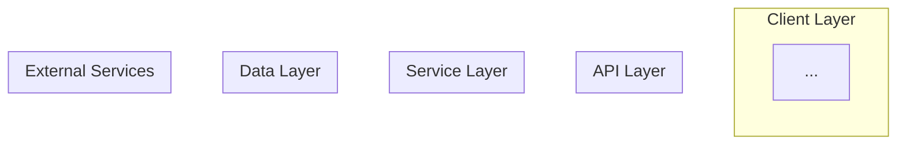
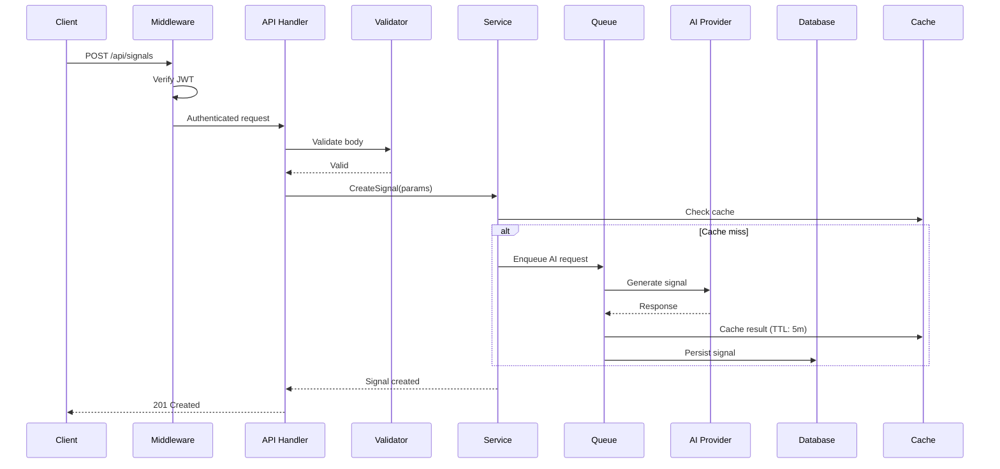
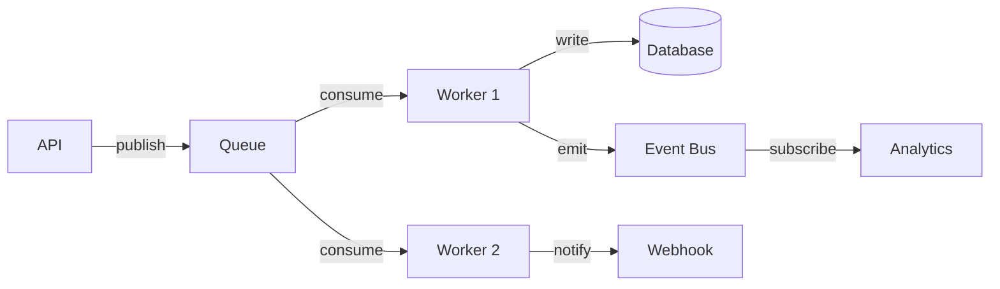
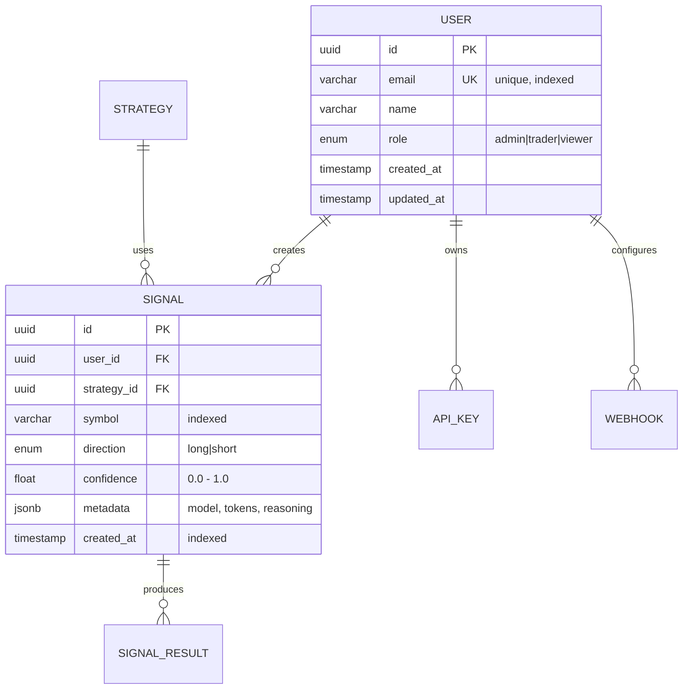
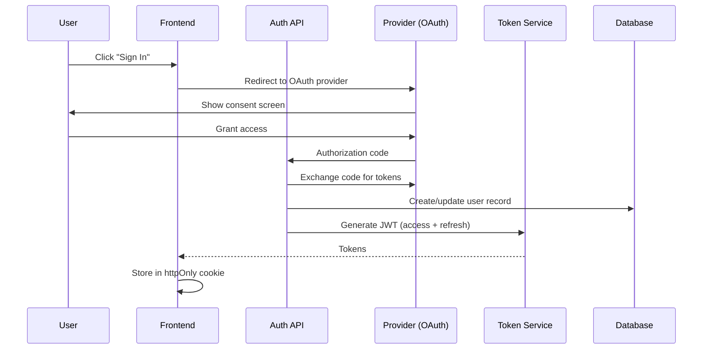
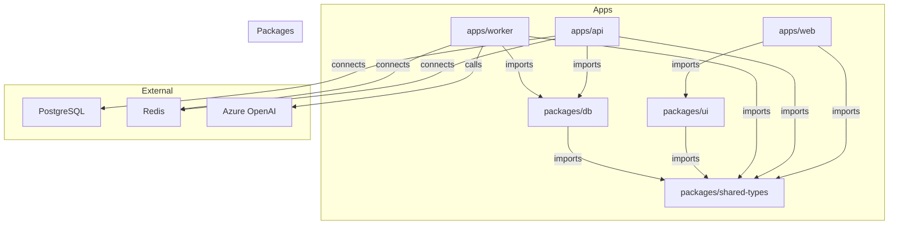

# Architecture Documentation Templates

Codebase Docs reads this file automatically. Use these templates when generating architecture and overview documentation.

---

## System Architecture Document Template

```markdown
# System Architecture

## Overview

{One paragraph: what the system does, who uses it, and the core value prop.}

## Architecture Diagram



## Technology Decisions

| Layer | Technology | Why |
|---|---|---|
| Frontend | ... | ... |
| Backend | ... | ... |
| Database | ... | ... |
| Cache | ... | ... |
| Queue | ... | ... |
| AI/ML | ... | ... |
| Infrastructure | ... | ... |
| CI/CD | ... | ... |

## Service Boundaries

{For each service/app in the system:}
- **Name:** What it does
- **Owns:** What data/domain it's responsible for
- **Exposes:** What APIs/interfaces it provides
- **Depends on:** What it needs from other services

## Key Architecture Decisions

| Decision | Choice | Alternatives Considered | Rationale |
|---|---|---|---|
| ... | ... | ... | ... |

## Constraints and Trade-offs

{List non-obvious constraints and trade-offs:}
- Why X instead of Y
- Known limitations
- Future migration paths
```


---

## Data Flow Document Template

```markdown
# Data Flow

## Request Lifecycle

{For each major operation, show how a request flows through the system:}

### Create Signal (Example)



## Event Flow

{For async/event-driven operations:}

### Background Processing



## Data Transformation

{Show how data changes shape as it moves through the system:}

| Stage | Shape | Example |
|---|---|---|
| Raw Input | Client request | `{ symbols: ["AAPL"], timeframe: "5m" }` |
| Validated | Domain object | `GenerateRequest { symbols, timeframe, strategy }` |
| Processed | AI response | `AISignal { direction, confidence, reasoning }` |
| Stored | DB record | `signals.id, symbol, direction, confidence, user_id` |
| Returned | API response | `{ signals: [...], metadata: { model, tokens } }` |
```

---

## ER Diagram Template

```markdown
# Database Schema

## Entity Relationship Diagram



## Models

### User

| Field | Type | Constraints | Description |
|---|---|---|---|
| `id` | `UUID` | PK, auto-generated | Unique identifier |
| `email` | `VARCHAR(255)` | Unique, Not Null, Indexed | Login email |
| `name` | `VARCHAR(100)` | Not Null | Display name |
| `role` | `ENUM` | Not Null, Default: 'trader' | Permission level |
| `created_at` | `TIMESTAMP` | Not Null, Default: now() | Account creation time |

**Indexes:** `ix_users_email` (unique)
**Relations:** Has many Signals, Has many ApiKeys
```

---

## Security Document Template

```markdown
# Security Architecture

## Authentication Flow



## Authorization Model

| Role | Permissions |
|---|---|
| `viewer` | Read own signals, Read public strategies |
| `trader` | All viewer + Create signals, Manage own strategies |
| `admin` | All trader + Manage users, View all data, System config |

## Permission Matrix

| Resource | Action | viewer | trader | admin |
|---|---|---|---|---|
| Signals | Read own | ✅ | ✅ | ✅ |
| Signals | Read all | ❌ | ❌ | ✅ |
| Signals | Create | ❌ | ✅ | ✅ |
| Signals | Delete | ❌ | Own only | ✅ |
| Users | Read | ❌ | ❌ | ✅ |
| Users | Manage | ❌ | ❌ | ✅ |
| Config | Modify | ❌ | ❌ | ✅ |

## Secrets Management

| Secret | Storage | Rotation | Access |
|---|---|---|---|
| Database password | Azure Key Vault | 90 days | Terraform SP + Workload Identity |
| AI API key | Azure Key Vault | Manual | Workload Identity only |
| JWT signing key | Environment variable | On deploy | App process only |
| OAuth client secret | Azure Key Vault | Annual | Auth service only |

## Network Security

| Layer | Control | Purpose |
|---|---|---|
| Edge | WAF + DDoS protection | Block malicious traffic |
| Transport | TLS 1.3 everywhere | Encrypt in transit |
| Network | NSG deny-all default | Block unauthorized access |
| Data | Private Endpoints | No public data plane exposure |
| Application | Rate limiting | Prevent abuse |
| Identity | Managed Identity | No stored credentials |
```

---

## Testing Document Template

```markdown
# Testing Strategy

## Test Pyramid

```
        /  E2E  \          ← Few, slow, high confidence
       /  Integ  \         ← Medium count, API contracts
      /   Unit    \        ← Many, fast, focused
     /______________\
```

| Type | Count | Speed | What It Tests |
|---|---|---|---|
| Unit | ~200 | < 5s total | Functions, utils, pure logic |
| Integration | ~50 | < 30s total | API routes, DB queries, service interactions |
| E2E | ~15 | < 2min total | Critical user flows end-to-end |

## Running Tests

```bash
# All tests
npm test                    # or: pytest, go test ./...

# Unit only
npm run test:unit           # or: pytest tests/unit/

# Integration
npm run test:integration    # or: pytest tests/integration/

# E2E
npm run test:e2e            # or: pytest tests/e2e/

# Coverage report
npm run test:coverage       # or: pytest --cov
```

## Test Patterns Used

| Pattern | Where | Example |
|---|---|---|
| Arrange-Act-Assert | Unit tests | Set up data → call function → verify result |
| Test fixtures | All | Reusable test data factories |
| Mocking | Unit tests | Mock external services (AI, DB) |
| Test database | Integration | Fresh DB per test suite |
| Snapshot testing | Components | Verify render output hasn't changed |
| Contract testing | API | Verify request/response shapes match spec |
```

---

## Getting Started Template

```markdown
# Getting Started

## Prerequisites

| Tool | Version | Installation |
|---|---|---|
| Node.js | >= 20.x | [nodejs.org](https://nodejs.org) |
| Python | >= 3.11 | [python.org](https://python.org) |
| Docker | >= 24.x | [docker.com](https://docker.com) |
| Terraform | >= 1.7 | [terraform.io](https://terraform.io) |

## Quick Start

```bash
# 1. Clone
git clone <repo-url>
cd <project>

# 2. Install dependencies
npm install          # Frontend
pip install -e .     # Backend

# 3. Set up environment
cp .env.example .env
# Edit .env with your values (see Config docs)

# 4. Start services
docker compose up -d    # Redis, PostgreSQL

# 5. Run migrations
npm run db:migrate      # or: alembic upgrade head

# 6. Start dev servers
npm run dev             # Frontend: http://localhost:3000
python -m uvicorn app.main:app --reload  # Backend: http://localhost:8000
```

## Verify Everything Works

```bash
# Health check
curl http://localhost:8000/health

# Run tests
npm test
pytest tests/ -q
```

## What's Next?

- [Architecture Overview](../01-overview/architecture.md) — understand the system
- [API Reference](../04-api-reference/_overview.md) — explore the APIs
- [First Contribution Guide](./first-contribution.md) — make your first PR
```

---

## Dependency Graph Template

```markdown
# Dependency Graph

## Package Dependencies



## Service Communication

| From | To | Protocol | Purpose |
|---|---|---|---|
| Web → API | REST/HTTP | JSON | All client operations |
| API → Worker | Redis Queue | JSON job payload | Async AI tasks |
| Worker → AI | HTTPS | OpenAI API | Signal generation |
| API → DB | TCP/TLS | SQL queries | Data persistence |
| API → Cache | TCP/TLS | Redis protocol | Response caching |
```
