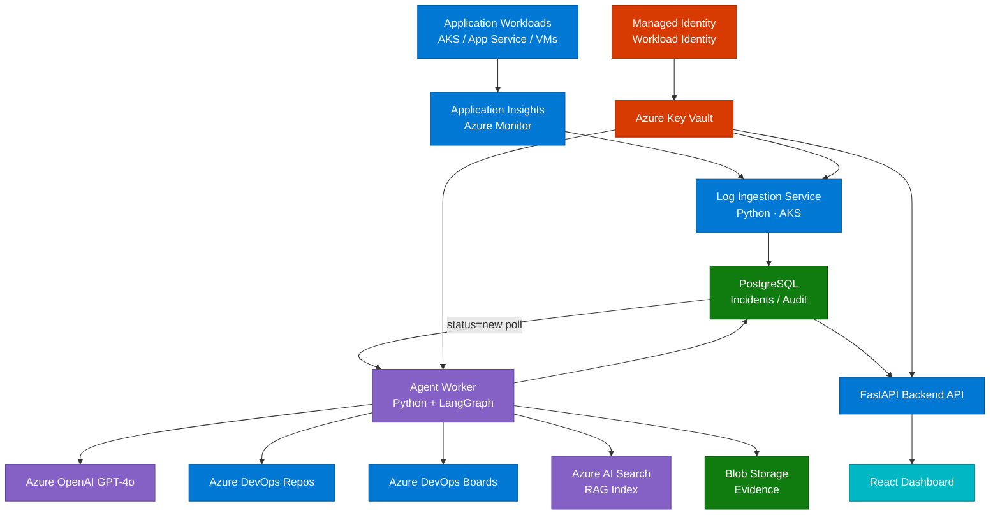

{/* This file is generated by scripts/sync_docs_site.py. Do not edit directly. */}

## Overview

RemediAI is a cloud-native agentic platform deployable on any Kubernetes cluster. Services share state through PostgreSQL; the incidents table `status` column serves as the coordination queue between the ingestion worker and the agent worker.

Phase 32 introduces provider profiles for runtime portability:

- `azure-foundry` (default): Azure AI Foundry / Azure OpenAI optimized path.
- `portable`: adapter-based profile for non-Azure Kubernetes deployments.

Provider selection is configuration-driven and resolved through
`packages/integrations/providers/registry.py`.

---

## Component Diagram



> **Color key:** Blue = Azure services &nbsp;·&nbsp; Purple = AI / Agent layer &nbsp;·&nbsp; Green = Data stores &nbsp;·&nbsp; Teal = UI &nbsp;·&nbsp; Red = Security

---

## Services

### Log Ingestion Service (`apps/worker/ingestion/`)

Polls Azure Monitor / Application Insights using KQL on a configurable schedule. Deduplicates exceptions by fingerprint hash. Persists new `Incident` records to PostgreSQL with `status='new'`.

- Runtime: Python
- Trigger: Azure Monitor KQL schedule (CronJob)
- Output: PostgreSQL `incidents` row with `status='new'`
- Auth: Managed Identity → Key Vault

### Agent Worker (`apps/worker/agents/`)

Polls PostgreSQL for incidents with `status='new'`. Runs the LangGraph pipeline for each incident. Writes analysis results, work item records, and audit entries to PostgreSQL.

- Runtime: Python + LangGraph
- Trigger: PostgreSQL poll (`status='new'` rows)
- Dependencies: Azure OpenAI, Azure DevOps REST, Azure AI Search, PostgreSQL
- Auth: Managed Identity

### Backend API (`apps/api/`)

FastAPI application exposing REST endpoints for the dashboard and external consumers. Reads from PostgreSQL. Does not write directly to Azure services.

- Runtime: Python + FastAPI
- Trigger: HTTP
- Dependencies: PostgreSQL, Redis (cache)
- Auth: Azure AD / API key (configurable)

Key dashboard-facing contracts include:

- Incident list/detail/metrics endpoints
- Integration health endpoint (`/api/v1/integrations/health`)
- Target registry endpoints (`/api/v1/targets*`)

### Dashboard (`apps/dashboard/`)

React + TypeScript SPA. Communicates only with the Backend API. Displays incidents, analyses, work item links, and metrics.

- Runtime: Node.js (build) / static hosting on AKS
- Dependencies: Backend API

---

## Infrastructure

All components run on AKS with Workload Identity for Managed Identity binding.

```text
infrastructure/
  terraform/
    modules/
      aks/
      servicebus/
      keyvault/
      aisearch/
      storage/
  helm/
        remediai/
  k8s/
    namespaces/
    serviceaccounts/
    network-policies/
```

---

## Deployment Model

- Each service has its own Helm chart and AKS Deployment.
- PostgreSQL and Redis run inside AKS as stateful workloads with persistent volumes.
- Secrets are mounted from Key Vault via the Azure Key Vault provider for Secrets Store CSI Driver.
- Log Ingestion and Agent Worker scale via KEDA using a PostgreSQL scaler (Phase 24).
- Backend API scales via HPA on CPU/memory.
- Database and cache traffic stay on the cluster network behind internal services.

---

## Observability

| Signal  | Tool                           |
| ------- | ------------------------------ |
| Logs    | Structured JSON → Azure Monitor Workspace |
| Traces  | OpenTelemetry → Azure Monitor  |
| Metrics | Prometheus → Azure Managed Grafana |
| Alerts  | Azure Monitor Alerts           |

All log lines include `correlation_id`, `incident_id`, `agent_name`, and `service` fields.
