# Agent Pipeline

RemediAI uses a **LangGraph-based multi-agent pipeline** to process application exceptions from ingestion through to remediation. Each agent has a single responsibility, a defined input/output contract, and writes an audit record for every execution.

---

## Pipeline diagram

```mermaid
flowchart LR
    classDef mvp fill:#107C10,stroke:#054B05,color:#fff
    classDef phase2 fill:#8661C5,stroke:#5C4799,color:#fff
    classDef terminal fill:#D83B01,stroke:#A52D01,color:#fff

    S(["Incident<br/>Received"]):::terminal
    TA["Triage<br/>Agent"]:::mvp
    RCA["Root Cause<br/>Agent"]:::mvp
    CCA["Code Context<br/>Agent"]:::mvp
    RAGA["RAG Retrieval<br/>Agent"]:::mvp
    FPA["Fix Planner<br/>Agent"]:::mvp
    BCA["Bug Creation<br/>Agent"]:::mvp
    E(["Bug Created"]):::terminal
    PRA["PR Agent"]:::phase2
    VA["Validation<br/>Agent"]:::phase2

    S --> TA --> RCA --> CCA --> RAGA --> FPA --> BCA --> E
    BCA -.->|"Phase 2<br/>human approval"| PRA
    PRA -.->|"Phase 2"| VA
    VA -.-> E
```



> **Color key:** Green = MVP agents · Purple = Phase 2 agents (dashed) · Red = Start / End nodes

---

## Agents at a glance

| Agent | LLM call? | Input | Output |
|-------|-----------|-------|--------|
| [Triage](./triage) | Yes | Exception + metadata | Priority, labels, group |
| [Root Cause](./root-cause) | Yes | Exception + stack trace | Structured root cause JSON |
| [Code Context](./code-context) | No | Stack frames + repo config | Source snippets |
| [RAG Retrieval](./rag-retrieval) | No | Root cause summary | Top K search results |
| [Fix Planner](./fix-planner) | Yes | Root cause + code + RAG | Ranked recommendations |
| [Bug Creation](./validation) | No | Incident analysis | ADO Bug ID + URL |
| [Validation](./validation) | Yes (Phase 2) | PR diff | Validation report |
| [PR Agent](./pr-agent) | No (Phase 2) | Approved recommendation | Branch + draft PR URL |

---

## Shared state — `IncidentState`

All agents operate on a single shared `IncidentState` TypedDict that is passed through the LangGraph graph. Each agent receives the full state and returns an updated copy.

```python
class IncidentState(TypedDict):
    # Input
    incident_id: str
    correlation_id: str
    exception_type: str
    exception_message: str       # PII-scrubbed before pipeline entry
    stack_trace: str             # PII-scrubbed before pipeline entry
    raw_payload: dict

    # Triage outputs
    priority: str | None
    triage_labels: list[str]
    group_id: str | None

    # Root cause outputs
    root_cause_summary: str | None
    root_cause_json: dict | None

    # Code context outputs
    code_snippets: list[CodeSnippet]

    # RAG outputs
    rag_results: list[RAGResult]

    # Fix planner outputs
    recommendations: list[Recommendation]

    # Bug creation outputs
    ado_bug_id: int | None
    ado_bug_url: str | None

    # Phase 2
    pr_branch: str | None
    pr_url: str | None
    validation_report: dict | None

    # Audit
    agent_trace: list[AgentTraceEntry]
    errors: list[str]
```

---

## Audit trail

Every agent appends an `AgentTraceEntry` to `state["agent_trace"]`:

```python
class AgentTraceEntry(BaseModel):
    agent_name: str
    prompt_version: str | None
    input_summary: str
    output_summary: str
    llm_model: str | None
    tokens_used: int | None
    latency_ms: int
    timestamp: datetime
    error: str | None
```

The full trace is persisted to `incident_analyses.agent_trace` (JSONB) and mirrored row-by-row to the `audit_log` table.

---

## Error handling

- Each agent wraps its logic in a `try / except` block.
- On error, the exception message is appended to `state["errors"]` and the agent returns state unchanged.
- The pipeline continues to the next agent unless the failed agent is **blocking** (Root Cause, Bug Creation).
- Incidents that fail a blocking agent are marked `status = 'analysis_failed'` and logged for manual review.
- Azure API calls (Service Bus, ADO, AI Search) have exponential-backoff retry with a configurable max attempts.

---

## Prompt versioning

All LLM prompts are stored as versioned Markdown files under `docs/prompts/`:

```
docs/prompts/
  triage_v1.md
  root_cause_v1.md
  fix_planner_v1.md
  validation_v1.md
```

Prompts are loaded by name and version at agent startup. The active version is recorded in every `AgentTraceEntry` for reproducibility and evaluation.
