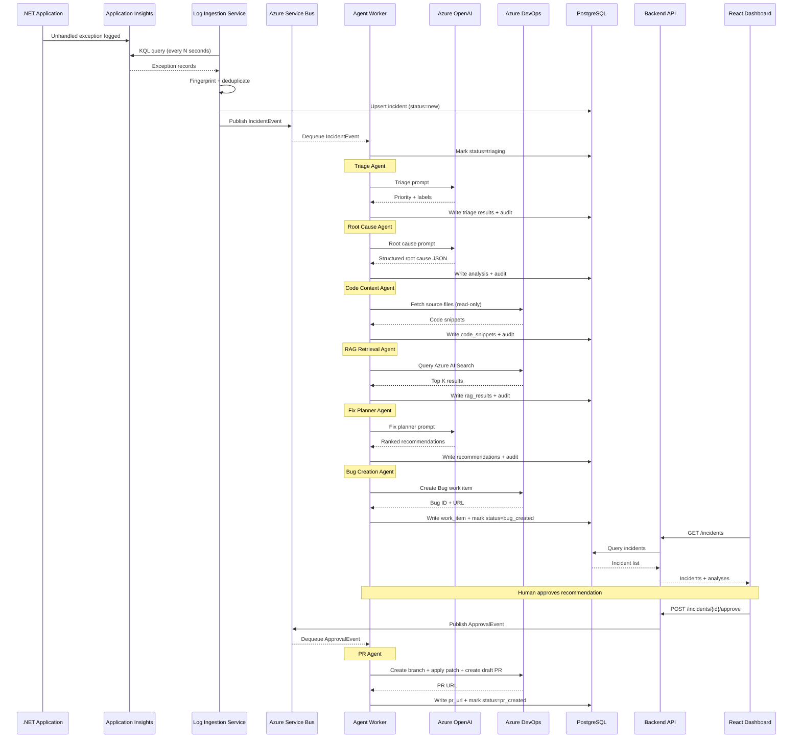
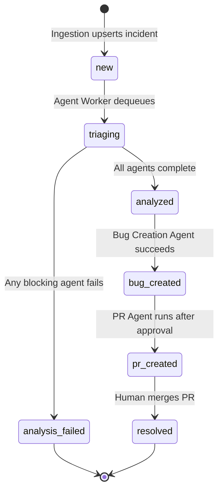

# Data Flow

This page traces a single exception from Application Insights through to an Azure DevOps Bug and (optionally) a draft pull request.

---

## End-to-end sequence



---

## Message contracts

### `IncidentEvent` (Service Bus message)

```json
{
  "incident_id": "3fa85f64-5717-4562-b3fc-2c963f66afa6",
  "correlation_id": "7d3f9a12-...",
  "source": "MyApp.Api",
  "exception_type": "System.NullReferenceException",
  "exception_message": "Object reference not set to an instance of an object.",
  "stack_trace": "   at MyApp.Services.UserService.GetById...",
  "raw_payload": { "environment": "production", "severity": "Error" },
  "timestamp": "2026-05-25T10:00:00Z"
}
```

### `ApprovalEvent` (Service Bus message)

```json
{
  "incident_id": "3fa85f64-5717-4562-b3fc-2c963f66afa6",
  "recommendation_rank": 1,
  "approved_by": "user@example.com",
  "approved_at": "2026-05-25T10:05:00Z"
}
```

---

## Incident status lifecycle



---

## Deduplication logic

The ingestion service computes a fingerprint for each exception:

```python
fingerprint = sha256(f"{exception_type}::{normalized_stack_trace}").hexdigest()
```

Where `normalized_stack_trace` strips line numbers, memory addresses, and timestamps so that the same logical exception from different deployments produces the same fingerprint.

On each poll cycle, exceptions with a known fingerprint in `status != resolved` are skipped — preventing duplicate incidents for the same recurring error.

---

## PII scrubbing in the flow

Before any exception payload is passed to Azure OpenAI:

1. `pii_scrubber.scrub()` runs on `exception_message` and `stack_trace`.
2. Emails → `[EMAIL]`, IPs → `[IP]`, UUIDs matching user ID patterns → `[USER_ID]`, SAS tokens → `[REDACTED]`.
3. The scrubbed text (not the original) is stored in PostgreSQL and sent to the LLM.
4. The scrubbing operation is recorded in the audit log.

See [PII Scrubbing](../security/pii-scrubbing) for the full pattern list.
