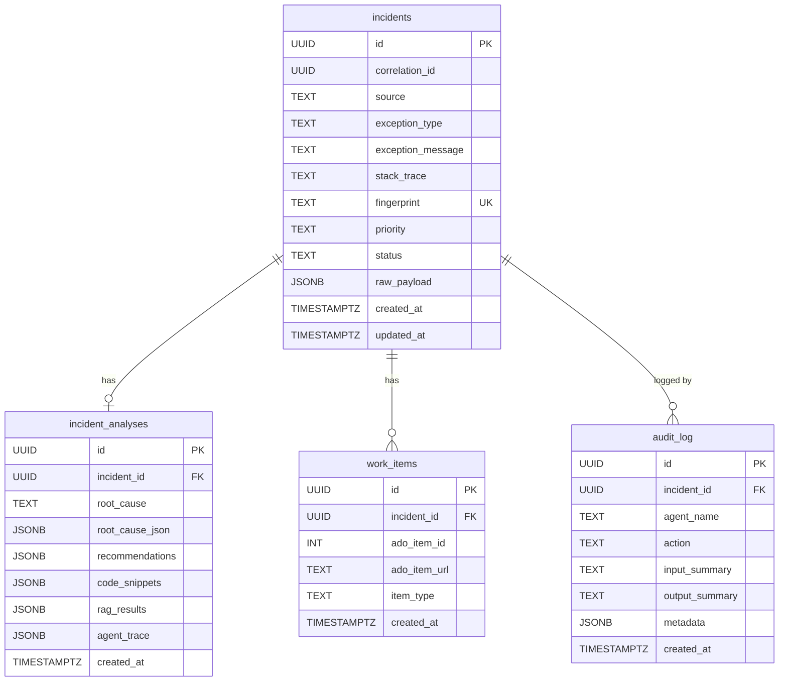

# Data Model

RemediAI uses PostgreSQL 16 as its primary data store. All tables are created and managed via Alembic migrations.

---

## Entity relationship



---

## Table reference

### `incidents`

The central table. One row per unique exception fingerprint.

| Column | Type | Description |
|--------|------|-------------|
| `id` | UUID | Primary key, auto-generated |
| `correlation_id` | UUID | Cross-service trace ID (from OpenTelemetry) |
| `source` | TEXT | Application name or Azure resource identifier |
| `exception_type` | TEXT | .NET exception class (e.g. `System.NullReferenceException`) |
| `exception_message` | TEXT | Exception message — PII-scrubbed before storage |
| `stack_trace` | TEXT | Full stack trace — PII-scrubbed before storage |
| `fingerprint` | TEXT | SHA-256 hash for deduplication; unique index |
| `priority` | TEXT | `critical` / `high` / `medium` / `low` |
| `status` | TEXT | See lifecycle below |
| `raw_payload` | JSONB | Original Application Insights record |
| `created_at` | TIMESTAMPTZ | First seen |
| `updated_at` | TIMESTAMPTZ | Last status change |

**Status lifecycle:** `new → triaging → analyzed → bug_created → pr_created → resolved` (or `analysis_failed`)

---

### `incident_analyses`

One row per incident. Populated by the agent pipeline.

| Column | Type | Description |
|--------|------|-------------|
| `id` | UUID | Primary key |
| `incident_id` | UUID | FK → `incidents.id` |
| `root_cause` | TEXT | Human-readable root cause summary |
| `root_cause_json` | JSONB | Structured breakdown (see below) |
| `recommendations` | JSONB | Ordered list of fix recommendations |
| `code_snippets` | JSONB | Source file extracts from Azure DevOps Repos |
| `rag_results` | JSONB | Top K results from Azure AI Search |
| `agent_trace` | JSONB | Full step-by-step reasoning audit |
| `created_at` | TIMESTAMPTZ | When analysis was written |

**`root_cause_json` shape:**

```json
{
  "component": "UserService.GetById",
  "likely_cause": "Unhandled null return from database query",
  "contributing_factors": ["Missing null check", "Repository pattern not validated"],
  "confidence": 0.87
}
```

**`recommendations` shape:**

```json
[
  {
    "rank": 1,
    "title": "Add null check before accessing user object",
    "description": "Check the return value of GetById for null before accessing properties.",
    "affected_files": ["/src/Services/UserService.cs"],
    "suggested_change": "if (user is null) return NotFound();",
    "confidence": 0.91,
    "source_refs": ["runbook://null-check-pattern", "prior_fix://incident-abc123"]
  }
]
```

---

### `work_items`

One row per Azure DevOps work item created by RemediAI.

| Column | Type | Description |
|--------|------|-------------|
| `id` | UUID | Primary key |
| `incident_id` | UUID | FK → `incidents.id` |
| `ado_item_id` | INTEGER | Azure DevOps work item ID |
| `ado_item_url` | TEXT | Direct link to the work item |
| `item_type` | TEXT | `bug` (or `task` for future use) |
| `created_at` | TIMESTAMPTZ | When the item was created |

---

### `audit_log`

Append-only. One row per agent action. No `UPDATE` or `DELETE` is permitted by application service accounts.

| Column | Type | Description |
|--------|------|-------------|
| `id` | UUID | Primary key |
| `incident_id` | UUID | FK → `incidents.id` (nullable for system events) |
| `agent_name` | TEXT | Which agent wrote this entry |
| `action` | TEXT | What the agent did (e.g. `triage_completed`) |
| `input_summary` | TEXT | Scrubbed summary of inputs |
| `output_summary` | TEXT | Summary of outputs |
| `metadata` | JSONB | Model version, prompt version, token count, latency |
| `created_at` | TIMESTAMPTZ | Immutable write timestamp |

---

## DDL (key tables)

```sql
CREATE TABLE incidents (
    id              UUID PRIMARY KEY DEFAULT gen_random_uuid(),
    correlation_id  UUID NOT NULL,
    source          TEXT NOT NULL,
    exception_type  TEXT NOT NULL,
    exception_message TEXT NOT NULL,
    stack_trace     TEXT,
    fingerprint     TEXT NOT NULL,
    priority        TEXT NOT NULL DEFAULT 'medium',
    status          TEXT NOT NULL DEFAULT 'new',
    raw_payload     JSONB,
    created_at      TIMESTAMPTZ NOT NULL DEFAULT now(),
    updated_at      TIMESTAMPTZ NOT NULL DEFAULT now(),
    CONSTRAINT incidents_fingerprint_key UNIQUE (fingerprint)
);

CREATE TABLE incident_analyses (
    id              UUID PRIMARY KEY DEFAULT gen_random_uuid(),
    incident_id     UUID NOT NULL REFERENCES incidents(id),
    root_cause      TEXT,
    root_cause_json JSONB,
    recommendations JSONB,
    code_snippets   JSONB,
    rag_results     JSONB,
    agent_trace     JSONB,
    created_at      TIMESTAMPTZ NOT NULL DEFAULT now()
);

CREATE TABLE work_items (
    id              UUID PRIMARY KEY DEFAULT gen_random_uuid(),
    incident_id     UUID NOT NULL REFERENCES incidents(id),
    ado_item_id     INTEGER NOT NULL,
    ado_item_url    TEXT NOT NULL,
    item_type       TEXT NOT NULL DEFAULT 'bug',
    created_at      TIMESTAMPTZ NOT NULL DEFAULT now()
);

CREATE TABLE audit_log (
    id              UUID PRIMARY KEY DEFAULT gen_random_uuid(),
    incident_id     UUID REFERENCES incidents(id),
    agent_name      TEXT NOT NULL,
    action          TEXT NOT NULL,
    input_summary   TEXT,
    output_summary  TEXT,
    metadata        JSONB,
    created_at      TIMESTAMPTZ NOT NULL DEFAULT now()
);
```

---

## Migrations

All schema changes are managed via Alembic. To create a new migration:

```bash
alembic revision --autogenerate -m "describe the change"
alembic upgrade head
```

To view migration history:

```bash
alembic history --verbose
```
