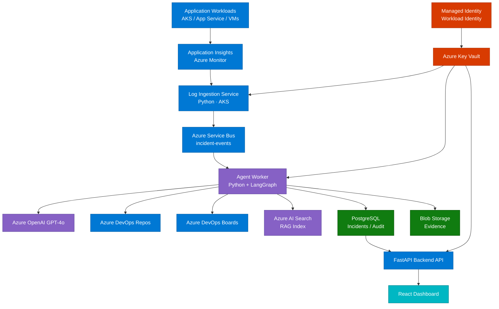

# Architecture Overview

RemediAI is a cloud-native agentic platform running on Azure. It is composed of independently deployable services that communicate via Azure Service Bus and share state through PostgreSQL.

---

## Component diagram

> **Color key:** Blue = Azure services · Purple = AI / Agent layer · Green = Data stores · Teal = UI · Red = Security

---

## Services

### Log Ingestion Service (`apps/worker/ingestion/`)

Polls Azure Monitor / Application Insights using KQL on a configurable schedule. Deduplicates exceptions by fingerprint hash (exception type + stack trace). Publishes new `IncidentEvent` messages to the `incident-events` Service Bus topic.

- **Runtime:** Python on AKS
- **Trigger:** Scheduled KQL query
- **Output:** Service Bus message → `incident-events`
- **Auth:** Managed Identity → Key Vault

### Agent Worker (`apps/worker/agents/`)

Subscribes to the `incident-events` Service Bus topic. Runs the LangGraph pipeline for each incident. Writes analysis results, work item records, and audit entries to PostgreSQL.

- **Runtime:** Python + LangGraph on AKS
- **Trigger:** Service Bus subscription
- **Dependencies:** Azure OpenAI, Azure DevOps REST, Azure AI Search, PostgreSQL
- **Auth:** Managed Identity
- **Scaling:** KEDA on Service Bus queue depth

### Backend API (`apps/api/`)

FastAPI application exposing REST endpoints for the dashboard and external consumers. Reads from PostgreSQL, uses Redis for response caching. Does not write directly to Azure services.

- **Runtime:** Python + FastAPI on AKS
- **Trigger:** HTTP
- **Auth:** Azure AD bearer token / API key (configurable)
- **Scaling:** HPA on CPU / memory

### Dashboard (`apps/dashboard/`)

React + TypeScript SPA. Communicates only with the Backend API. Displays incidents, analyses, work item links, and metrics. Provides the approval workflow for the PR Agent.

- **Runtime:** Static hosting on AKS (Nginx container)
- **Dependencies:** Backend API only
- **Build:** Vite + TypeScript

---

## Deployment model

All services run on **Azure Kubernetes Service (AKS)** with Workload Identity for Managed Identity binding:

- Each service has its own Helm chart and AKS Deployment.
- Secrets are mounted from Key Vault via the Azure Key Vault provider for Secrets Store CSI Driver.
- Log Ingestion and Agent Worker scale via **KEDA** on Service Bus queue depth.
- Backend API scales via **HPA** on CPU and memory.
- PostgreSQL is hosted on Azure Database for PostgreSQL — Flexible Server.

---

## Observability

| Signal | Tool |
|--------|------|
| Logs | Structured JSON via `structlog` → Azure Monitor Workspace |
| Traces | OpenTelemetry → Azure Monitor |
| Metrics | Prometheus → Azure Managed Grafana |
| Alerts | Azure Monitor Alerts |

Every log line includes `correlation_id`, `incident_id`, `agent_name`, and `service` fields for end-to-end traceability.

---

## Related docs

- [Data Flow](./data-flow) — step-by-step message flow through the system
- [Data Model](./data-model) — database schema for incidents, analyses, and work items
- [Technology Stack](./tech-stack) — full stack table with rationale
